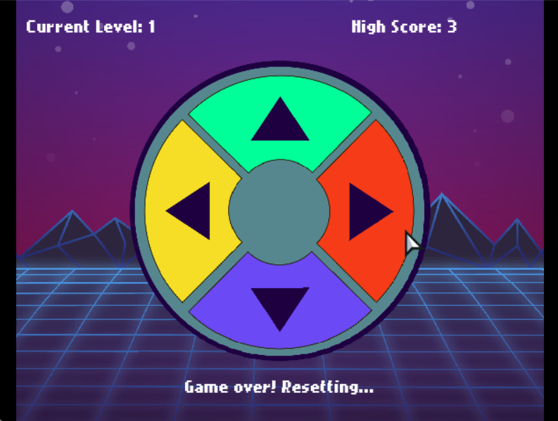

SimonGame
=========

**General**

Welcome to SimonGame - a retro, software version of an old handheld memory game called Simon.

To play Simon, simply listen to and watch the pattern that the computer plays, then play the same pattern back again. You'll have 3 tries to get it right or it's game over!

**Gameplay**

Simply use the keyboard keys (you can use the arrows, as indicated on the buttons, or WASD) or use the mouse to click on the buttons. Watch and listen to the computer, then repeat the same pattern.

**Installation**

To install and run the project, you will need to install the Random Haxe library. You can do so by running the following command on the command line:

	haxelib install random